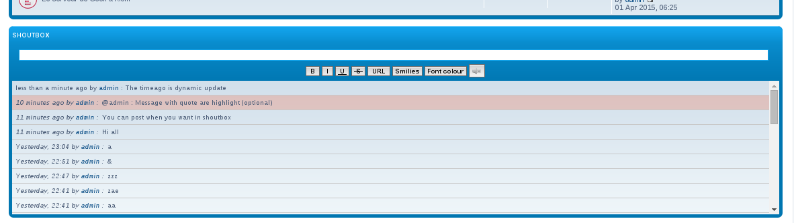
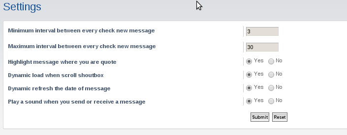

Shoutbox for phpbb 3.1.x
========================

Install
=======

Download this code and copy it in your phpbb install under the `ext` directory.
You could have this path : `phpbb_install/ext/matthieuy/shoutbox`

- Go into your ACP => Customise => Manage extension
- Enable this extension
- Enjoy

Screenshots
===========

Develop
=======

You can propose pull request or open a issue if you need more informations.
For CSS you need sass (don't edit the css file)

Licence :
=========

This code is under [GNU GPL 2.0](http://opensource.org/licenses/gpl-2.0.php)

Changelog
=========

- v0.1.3 (01/03/2016) :
    - Github repo

- v0.1.2 (08/30/2015) :
    - Some fix
    - Screenshots
    - Breadcrumb
    - Page title
    - Shoutbox on Who is online page

- v0.1.1 (08/30/2015) : 
    - Bugfix : play sound

- v0.1.0 (08/29/2015) :   
    - First commit
    - Rights
    - Possibility to delete a message
    - Settings
    - Infinit scroll
    - Sounds
    - French and english translate

TODO
====

- Unit tests
